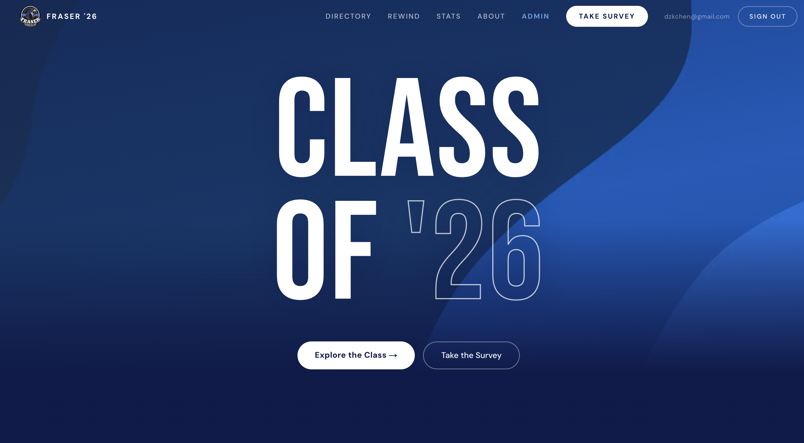
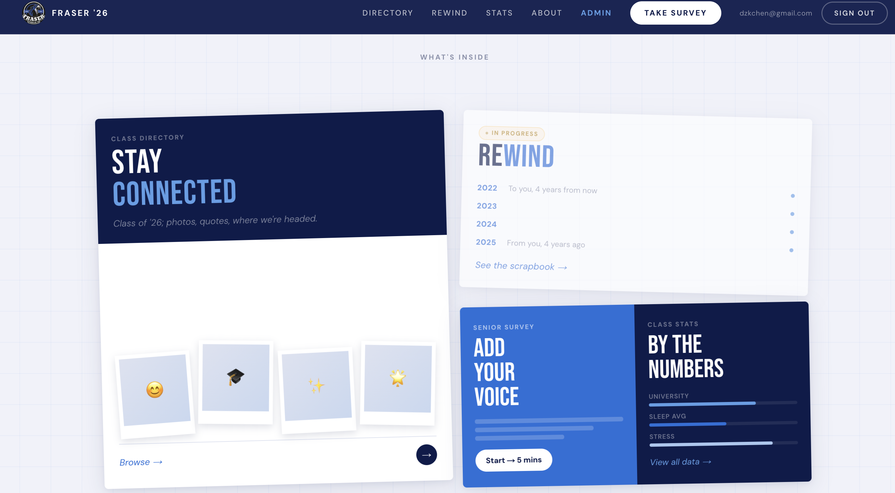
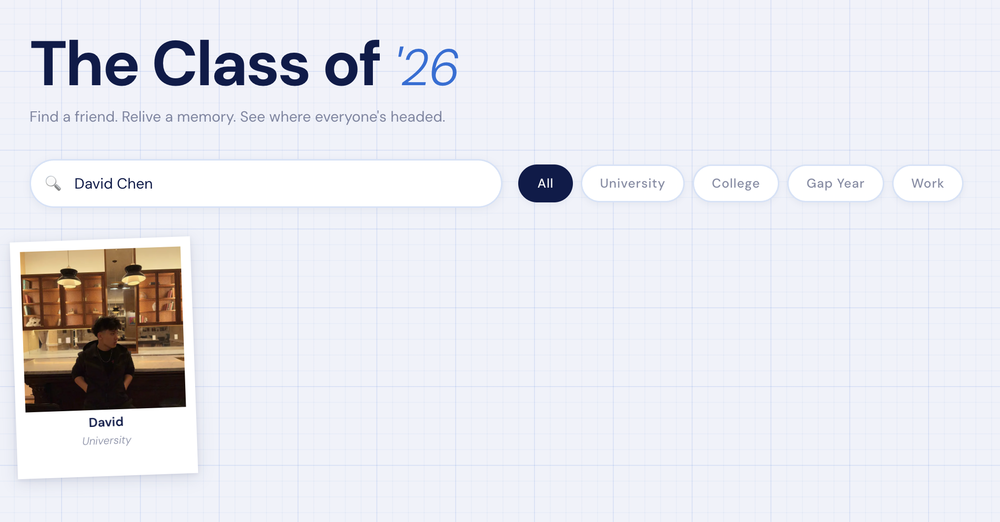
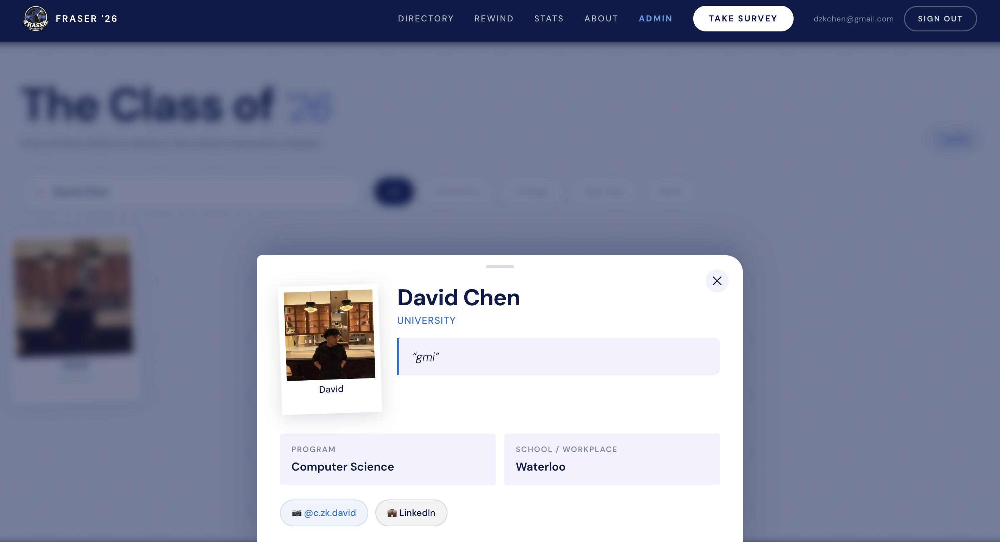
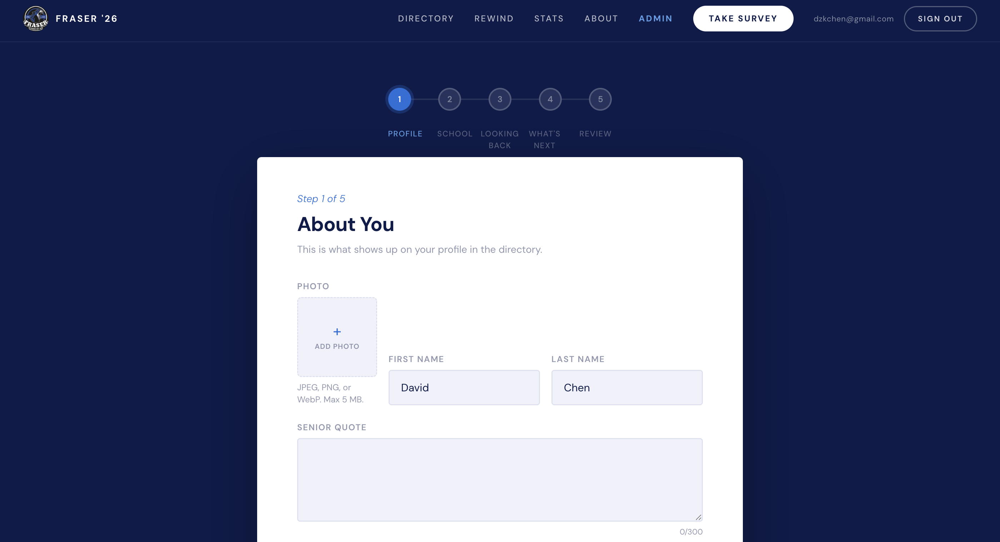

<h1 align="center">Fraser Grads '26</h1>


Fraser Grads '26 is an unofficial grad site for Fraser's Class of 2026. It puts the class directory, senior survey, class stats, and future memory/scrapbook features in one place so our grad class can look back after graduation and stay connected. Also a good way for lower grades to reach out or see some stats to know more about senior life!

This project was a fun way to make a project that actually matters but allows me to learn (Golang + Docker + etc)

## Screenshots











## Tech Stack

- **Frontend:** Next.js 16 App Router, React 19, TypeScript, Tailwind CSS 4
- **Auth:** Auth.js / NextAuth v5 beta with Google OAuth and the Postgres adapter
- **API:** Go 1.26, chi router, HMAC-signed internal requests from Next.js
- **Database:** Postgres (Supabase)
- **Object storage:** Cloudflare R2 for submitted photos
- **Charts:** Recharts
- **Validation:** Zod in the Next.js app, generated Go validators for API-side survey validation
- **Deployment shape:** Next.js on Vercel, Go API on Cloud Run or any HTTP host, Postgres and R2 as managed services

## How Everything Connects

The app is split into two main services:

- **Next.js app:** public pages, auth UI, server actions, cached data loaders, and small proxy/API routes.
- **Go API:** database writes/reads, R2 upload signing, backend validation, admin mutations, and stats aggregation.

```text
                                  +----------------------+
                                  |       Browser        |
                                  | pages, forms, photos |
                                  +----------+-----------+
                                             |
                                             v
+----------------------+        +------------+-------------+
|   Google OAuth       | <----> |        Next.js app       |
| via Auth.js          |        | app/, components/, lib/  |
+----------------------+        +------+----------+--------+
                                        |          |
                                        |          | direct PUT with signed URL
                           HMAC-signed  |          v
                           internal API |   +------+-------+
                                        |   | Cloudflare R2|
                                        v   | survey photos|
                              +---------+---+--------------+
                              |        Go API              |
                              | api/cmd + api/internal     |
                              +-------------+--------------+
                                            |
                                            v
                                  +---------+----------+
                                  |      Postgres      |
                                  | Auth.js + surveys  |
                                  +--------------------+
```

### Codebase Map

```text
grad-26/
|
|-- app/                         Next.js App Router
|   |-- page.tsx                  Home page
|   |-- layout.tsx                Global shell: nav, footer, fonts, cookie banner
|   |-- survey/
|   |   |-- page.tsx              Requires login, checks if the user already submitted
|   |   |-- actions.ts            Server actions: validate + submit survey
|   |   `-- thanks/page.tsx       Auth-protected thank-you page
|   |-- directory/page.tsx        Server-rendered first page of approved grads
|   |-- stats/page.tsx            Server-rendered class stats
|   |-- admin/
|   |   |-- page.tsx              Admin-only submission review table
|   |   |-- actions.ts            Approve, unapprove, delete
|   |   `-- RowActions.tsx        Client buttons/dialog for each submission
|   |-- api/
|   |   |-- auth/[...nextauth]/   Auth.js route handlers
|   |   |-- upload-url/route.ts   Asks Go API for signed R2 upload URL
|   |   `-- directory/route.ts    "Load more" endpoint for directory pagination
|   `-- rewind/                  Static scrapbook/timeline experience
|
|-- components/
|   |-- survey/                   Survey wizard fields and photo picker
|   |-- stats/                    Stats page renderer
|   |-- charts/                   Recharts-based chart components
|   |-- DirectoryClient.tsx       Directory search/filter/modal/load-more UI
|   |-- Nav.tsx                   Auth-aware navigation
|   `-- loading.tsx               Shared skeletons/spinners
|
|-- lib/
|   |-- auth.ts                   Auth.js config, requireUser, requireAdmin
|   |-- go-client.ts              HMAC-signed fetch client for Go API
|   |-- schemas.ts                Zod survey validation from question schema
|   |-- rate-limit.ts             In-memory Next-side rate limiter
|   |-- data/
|   |   |-- directory.ts          Cached /directory loader, tag: directory
|   |   |-- stats.ts              Cached /stats/aggregates loader, tag: stats
|   |   `-- admin.ts              Uncached admin list loader
|   `-- rewind.ts                 Validates static rewind JSON
|
|-- content/
|   |-- survey-questions.ts       TypeScript source of truth for survey questions
|   |-- survey-questions.json     JSON sidecar used by codegen
|   |-- colleges/universities...  Autocomplete data for survey fields
|   `-- rewind.json               Static rewind timeline data
|
|-- api/                          Go backend
|   |-- cmd/server/main.go        Wires router, middleware, DB, R2, handlers
|   `-- internal/
|       |-- auth/                 HMAC verification + admin allowlist parsing
|       |-- db/                   pgx pool setup
|       |-- handlers/             survey, upload, directory, stats, admin, health
|       |-- questions/            Generated Go question schema + validation
|       |-- r2/                   Cloudflare R2 S3-compatible wrapper
|       `-- ratelimit/            Go-side in-memory rate limiter
|
|-- db/migrations/                Auth.js tables and surveys table
`-- scripts/gen-questions-go.ts   Generates api/internal/questions/questions_gen.go
```

### Survey Submission Flow

This is the most important write path in the project. The browser never sends the uploaded photo through Next.js or Go; it uploads directly to R2 using a short-lived signed URL.

```text
1. User opens /survey
   |
   v
2. app/survey/page.tsx calls requireUser()
   |
   v
3. Next calls Go: GET /me/survey
   - signed by lib/go-client.ts
   - Go verifies HMAC in api/internal/auth/hmac.go
   - Go checks that X-Caller-Email matches user_id
   |
   +--> already submitted: redirect to /survey/thanks
   |
   `--> not submitted: render components/survey/SurveyForm.tsx

4. User fills the wizard and clicks submit
   |
   v
5. app/survey/actions.ts runs validateSurveyFields()
   - converts FormData into survey input
   - validates with lib/schemas.ts + content/survey-questions.ts
   |
   +--> invalid: return field errors to the wizard
   |
   `--> valid: continue

6. Browser asks Next for an upload URL
   POST /api/upload-url
   |
   v
7. Next checks auth/rate limit, then calls Go: POST /upload/url
   |
   v
8. Go validates content type/size and returns:
   - signed R2 PUT URL
   - object key like surveys/<uuid>.jpg
   |
   v
9. Browser PUTs the photo directly to Cloudflare R2
   |
   v
10. Next finalizes the survey with Go: POST /survey
    |
    v
11. Go validates everything again
    - caller email matches Auth.js user row
    - photo key shape is valid
    - R2 object exists and is 1 byte..5 MB
    - answers match generated Go question validators
    |
    v
12. Go inserts into Postgres surveys
    - id comes from the photo object UUID
    - user_id is unique, so one survey per account
    - approved_at controls public visibility
```

## Local Setup

Install dependencies:

```bash
npm install
```

Create a local env file:

```bash
cp .env.example .env
```

Apply the database migrations in `db/migrations/` to your Postgres database. The first migration creates the Auth.js adapter tables plus the `surveys` table.

Start the Go API in one terminal:

```bash
cd api
go run ./cmd/server
```

Start the Next.js app in another terminal:

```bash
npm run dev
```

## Code Quality Note

This codebase was built with product shipping as the priority. Some areas are intentionally pragmatic rather than the cleanest possible architecture: duplicated UI patterns, rough edges around deployment setup, limited abstractions, and features that were finished under deadline pressure. Treat the current code as a working product baseline, not a polished reference implementation.
